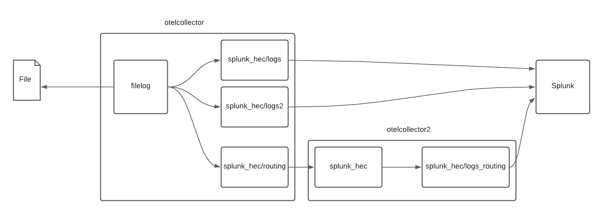

# OpenTelemetry complex routing example

This example showcases how the collector can collect data from files and route it to multiple destinations at once.

For the purpose of demonstration, we created two collectors.

One collector collects data from a file, and sends it to Splunk with two different exporters, showing how it is possible to send to multiple Splunk instances with one collector.

The collector also sends data to a second separate collector which is targeting Splunk with a different index.



The example runs as a Docker Compose deployment. The collector is configured to send logs to Splunk Enterprise.

Splunk is configured to receive data from the OpenTelemetry Collector using the HTTP Event collector. To learn more about HEC, visit [our guide](https://dev.splunk.com/enterprise/docs/dataapps/httpeventcollector/).

To deploy the example, check out this git repository, open a terminal and in this directory type:
```bash
$> docker-compose up
```

Splunk will become available on port 18000. You can login on [http://localhost:18000](http://localhost:18000) with `admin` and `changeme`.

Once logged in, visit the [search application](http://localhost:18000/en-US/app/search) to see the logs collected by Splunk.

You will see that we used routing to send logs to three different indexes: `logs`, `logs2`, `logs_routing`.
